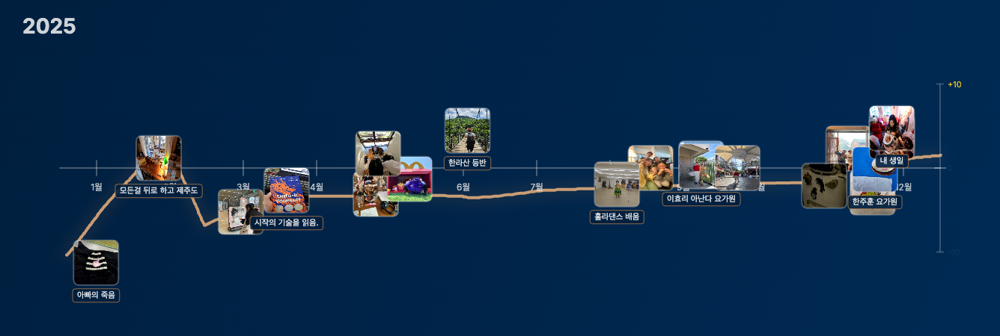

# Life Curve - 인생곡선 타임라인

사진의 메타데이터(EXIF)를 활용하여 일년의 타임라인에 자동으로 배치하고, 인생곡선을 직접 그려볼 수 있는 인터랙티브 웹 애플리케이션입니다.

## 🚀 바로 사용하기

**👉 [https://yesinkim.github.io/life-curve-w-photos/](https://yesinkim.github.io/life-curve-w-photos/)**

별도의 설치 없이 브라우저에서 바로 사용할 수 있습니다!

## 📸 예시



*2025년 타임라인 예시 - 사진에 이벤트 라벨을 추가하고 인생곡선을 그린 모습*

## 🎨 주요 기능

- **사진 업로드**: 드래그 앤 드롭 또는 파일 선택으로 간편하게 사진 업로드
- **EXIF 메타데이터 자동 추출**: 사진의 촬영 날짜를 자동으로 파싱
- **날짜 수정**: 사진 촬영 날짜를 직접 편집 가능
- **이벤트 라벨링**: 사진 클릭 후 이벤트 이름 추가 (예: 생일 파티, 여행 등)
- **자동 연도 선택**: 가장 많은 사진이 있는 연도를 자동으로 선택
- **타임라인 시각화**: 사진을 1년 타임라인에 정확하게 배치
- **가로/세로 방향 전환**: 원하는 방향으로 타임라인 표시
- **인터랙티브 곡선 그리기**: 마우스로 직접 인생곡선 그리기 (Ctrl+휠로 확대/축소)
- **PNG 내보내기**: 완성된 타임라인을 이미지로 다운로드
- **프리미엄 디자인**: 다크모드 기반의 현대적이고 세련된 UI

## 📖 사용 방법

1. **사진 업로드**: 일년의 추억이 담긴 사진 20장 내외를 업로드
2. **날짜 수정** (선택): 사진 위 연필 아이콘으로 날짜 편집
3. **타임라인 생성**: "타임라인 생성하기" 버튼 클릭
4. **이벤트 라벨 추가** (선택): 사진 클릭 → 이벤트 이름 입력 → 저장
5. **방향 선택**: 가로 또는 세로 방향 선택
6. **곡선 그리기**: "곡선 그리기" 버튼 클릭 후 캔버스에 자유롭게 그리기
7. **확대/축소**: Ctrl+마우스휠 또는 하단 슬라이더로 확대/축소
8. **내보내기**: "내보내기" 버튼으로 PNG 이미지 다운로드

## 💻 로컬에서 실행하기

프로젝트를 클론한 후 간단한 HTTP 서버를 실행합니다:

```bash
# Python 3
python3 -m http.server 8000

# 또는 Node.js의 serve
npx -y serve .
```

브라우저에서 `http://localhost:8000` 접속

## 📋 기술 스택

- **HTML5**: 구조
- **CSS3**: 스타일링 (Glassmorphism, 애니메이션)
- **JavaScript (Vanilla)**: 로직 및 상호작용
- **Canvas API**: 타임라인 및 곡선 렌더링
- **exifr**: EXIF 메타데이터 추출

## 🎯 지원 이미지 형식

- JPEG / JPG
- PNG
- HEIC
- 기타 브라우저가 지원하는 이미지 형식

## 💡 향후 계획

- AI 기반 감정 분석 (사진의 감정을 자동으로 분석하여 곡선 자동 생성)
- PDF 내보내기
- 여러 해 타임라인 뷰 (다년간 타임라인 비교)
- 타임라인 공유 기능 (인터랙티브 HTML 파일 내보내기)

## 📝 라이선스

개인 및 교육용으로 자유롭게 사용 가능합니다.

---

Made with ❤️ by Life Curve Team
